# library_manager
# About The Project
A desktop-based Library Management System developed using Python and PySide6.
The system allows managing books, users, and loan operations with proper business rules and availability validation
# Technologies Used
1 Python 3
2 PySide6 (GUI)
3 OOP Design
4 Git & GitHub
5 Jira (Project Management)
# Project Implementation Stages
1️ Requirements Analysis
The core system functionalities were identified, such as book management, loan (borrow/return) operations, and availability validation.
2️ System Design
The system architecture was designed using Object-Oriented Programming (OOP) principles and divided into layers (Models – Business Logic – User Interface).
3️ Task Distribution
Tasks were distributed among team members using Jira, with each member responsible for a specific part of the project.
4️ Implementation (Development)
The system was developed using Python and PySide6, applying business rules and data validation logic.
5️ Testing and Review
All operations such as borrowing and returning books were tested to ensure correctness before publishing the final project on GitHub.
# Task Distribution
The project tasks were distributed among the team members as follows:
# Roula Alismail
Set up the development environment and configured the database.
# Doaa Al Shashw
Implemented the Repository layer, including book, member, and loan management.
# Nahla Aladel
Developed the Service layer, applying business logic, validation rules, and availability checks.
# Nisreen Alkurdi
Developed the graphical user interface (GUI) using PySide6, including the main window and management screens for books and members
# Work Plan
The project was developed following an Agile approach. Requirements were defined, then tasks were divided and managed using Jira.
The system was implemented using a layered architecture (Database, Repositories, Services, and UI), with Git used for branch management and merging.
Finally, the system was tested to ensure full integration before final submission.
# Screenshots from Jira
1 Roula Ismail :Development environment setup , Database setup and configuration
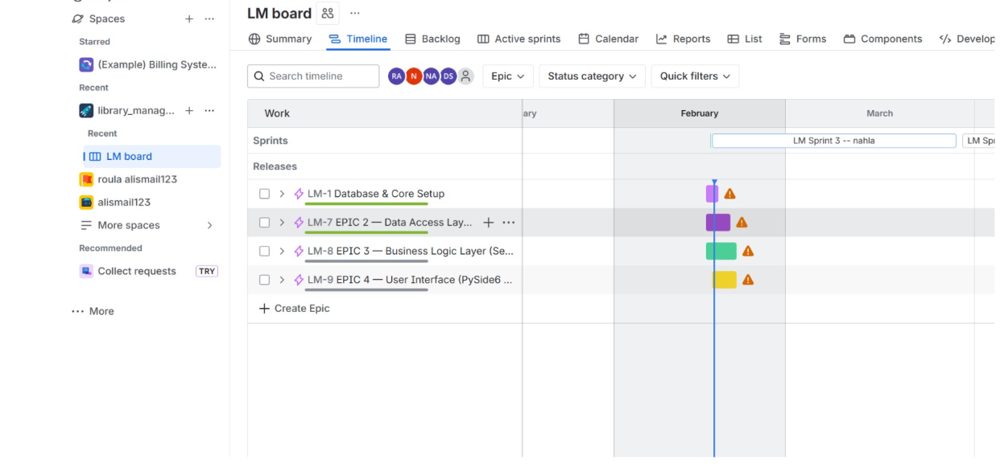
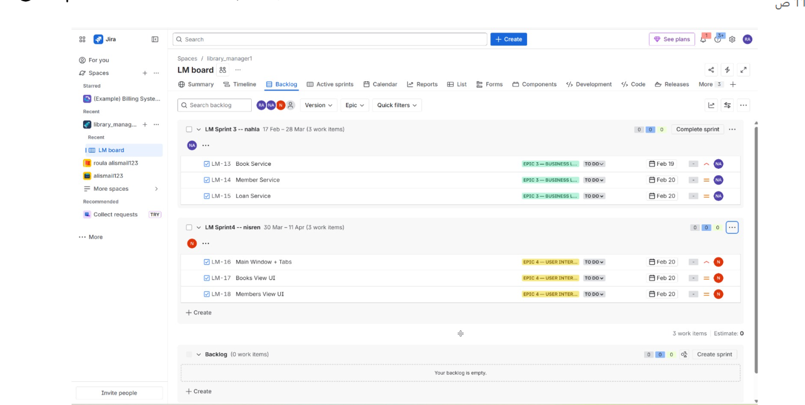
2 Doaa Al Shashw :  Implementation of the Repository layer , Book, Member, and Loan repositories
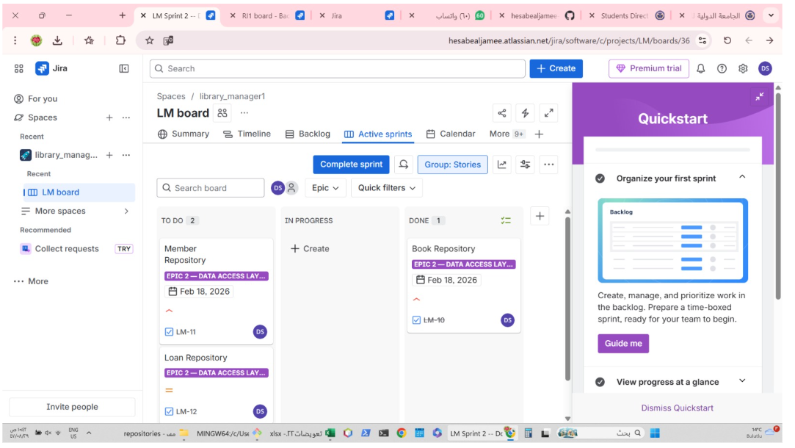
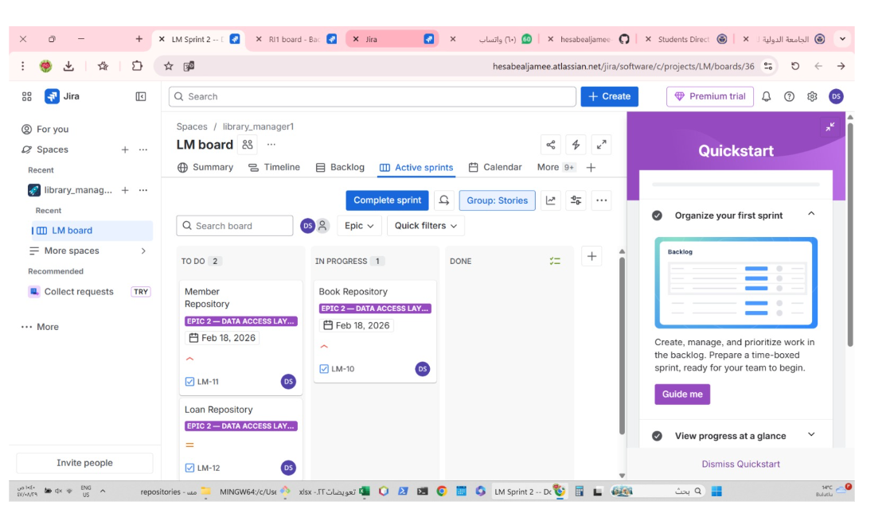
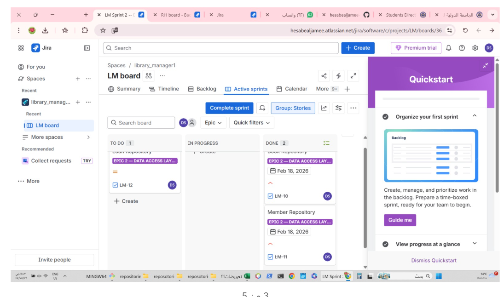
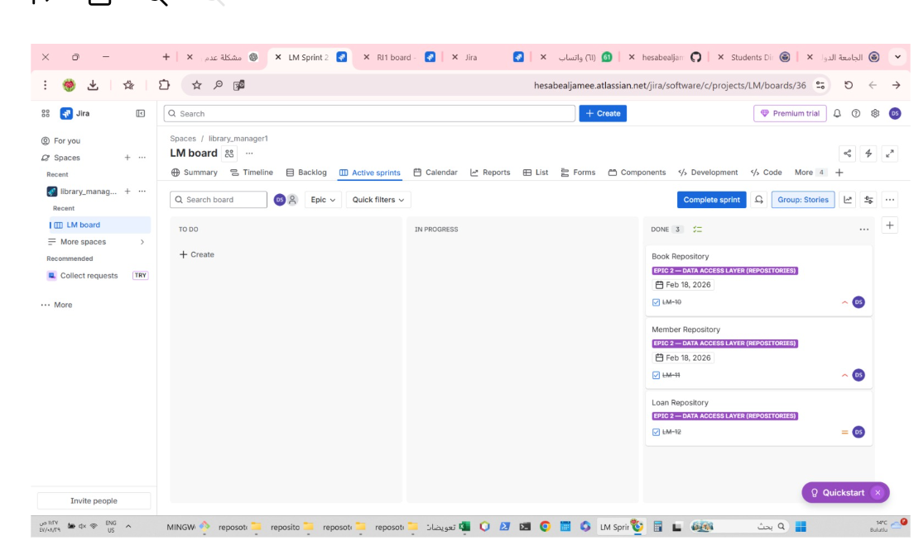
3 Nahla Aladel : Implementation of the Service layer ,Applying business logic and validation rules ,Availability checks
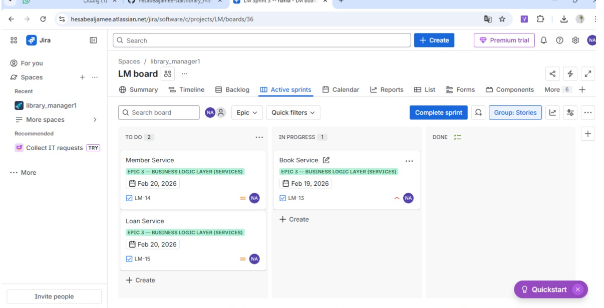
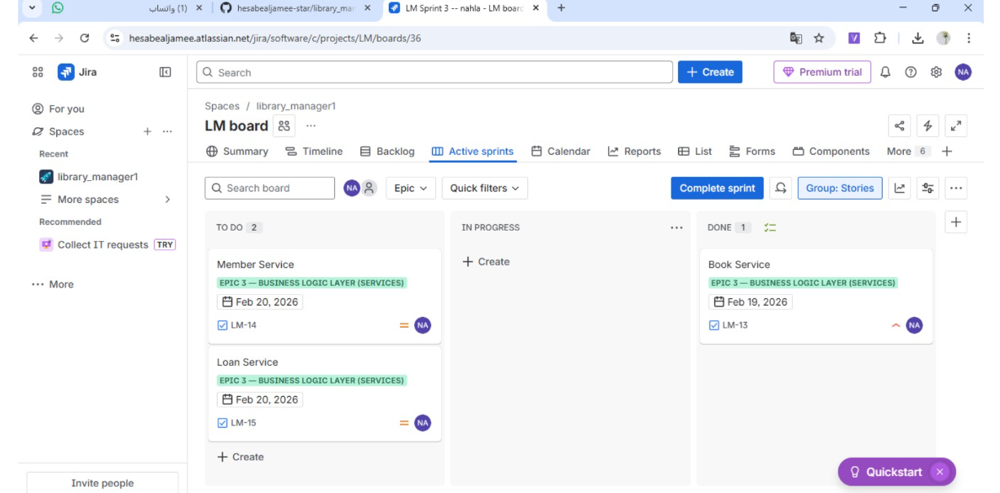
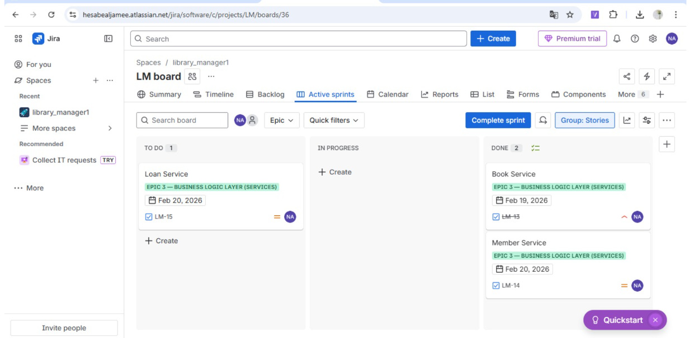

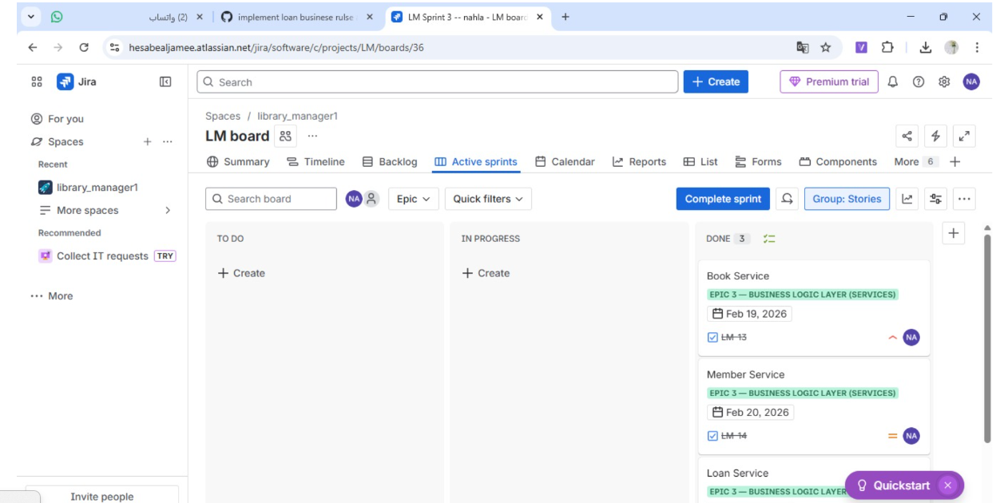
3 Nisreen Alkurdi : GUI development using PySide6 ,Creating the main window and management screens
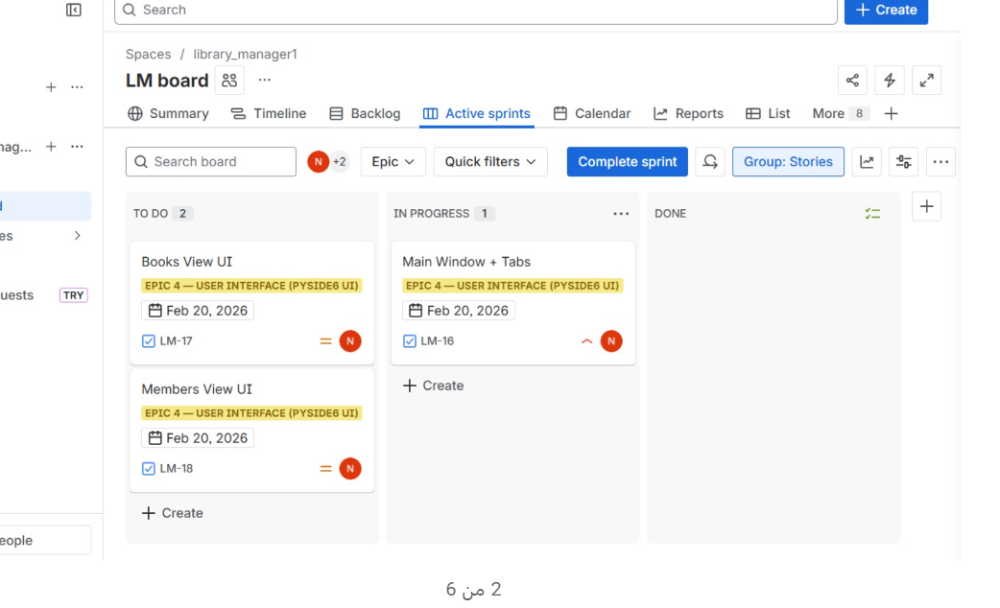
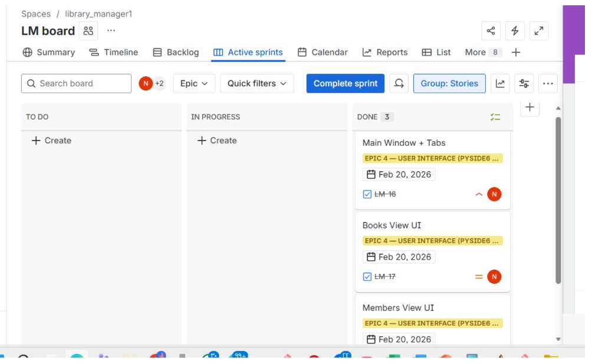

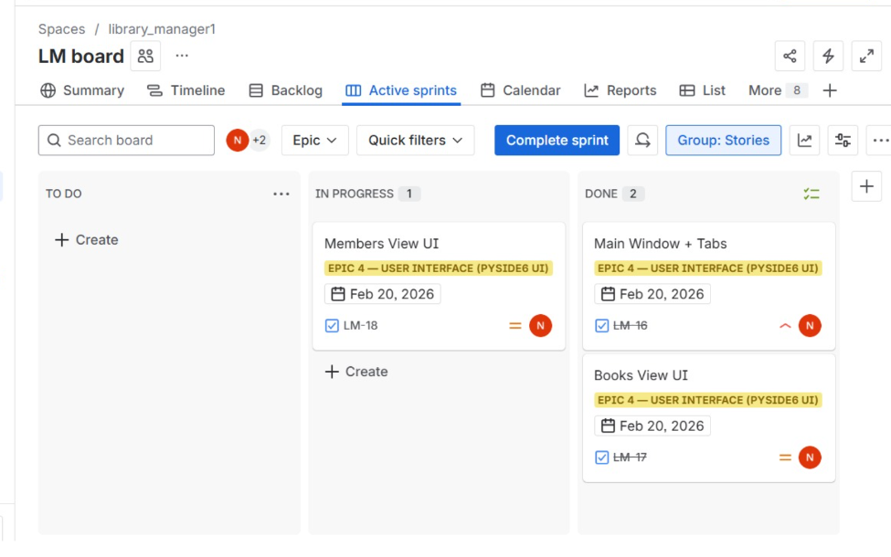
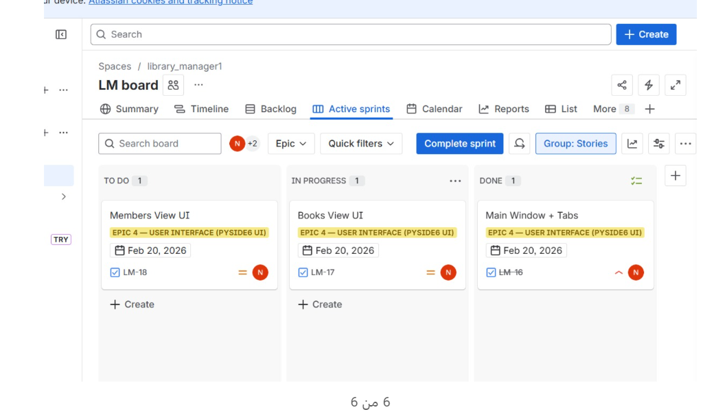
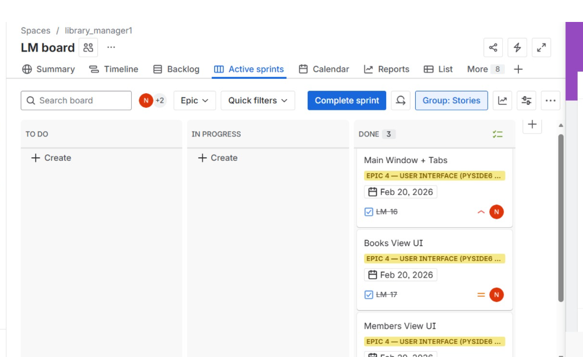
# GitHub Workflow
GitHub was used to manage collaboration among team members, where each member worked on a separate branch for their assigned feature.
After completing the changes, they were committed and pushed to the repository.
A Pull Request was then created to review the code before merging it into the main branch.

